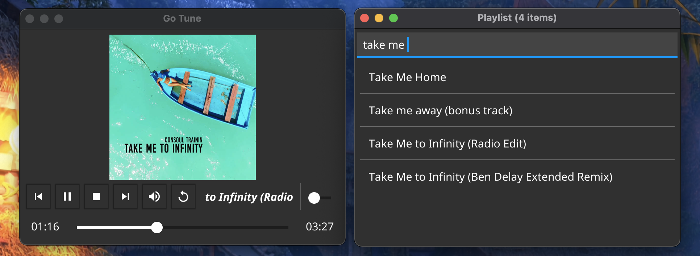
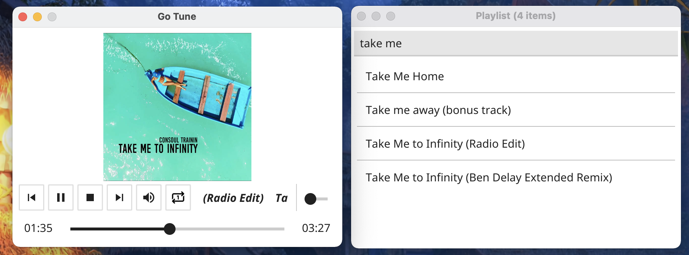

# Go Tune
A music player written in golang under development, was created as a part to learn [Fyne](https://fyne.io/)

Uses [Bass library](http://www.un4seen.com/bass.html) as audio engine

### Features
- Playlist
- Save history and reload
- Audio + Tracker modules support

#### Bundle resource
```bash
fyne bundle --package=res --prefix=Resource music.png >> res/logo.go
```

#### Build
```bash
make build
```

#### Create app for Mac
```bash
make package
```




### Contribution
Please feel free to fork the repository and submit your changes as a PR with description of changes/features