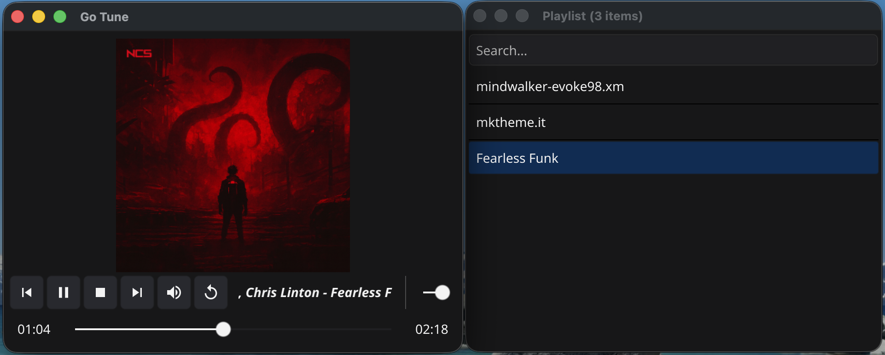
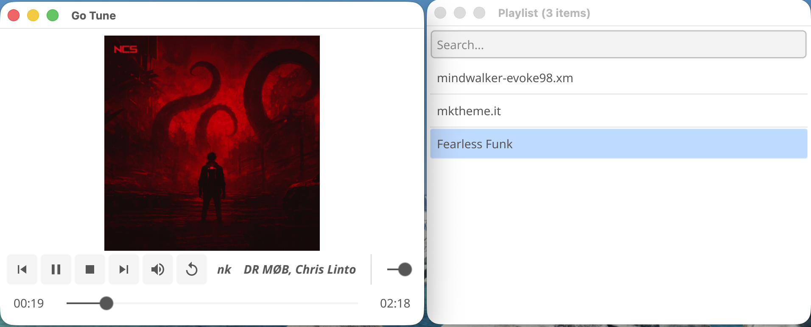
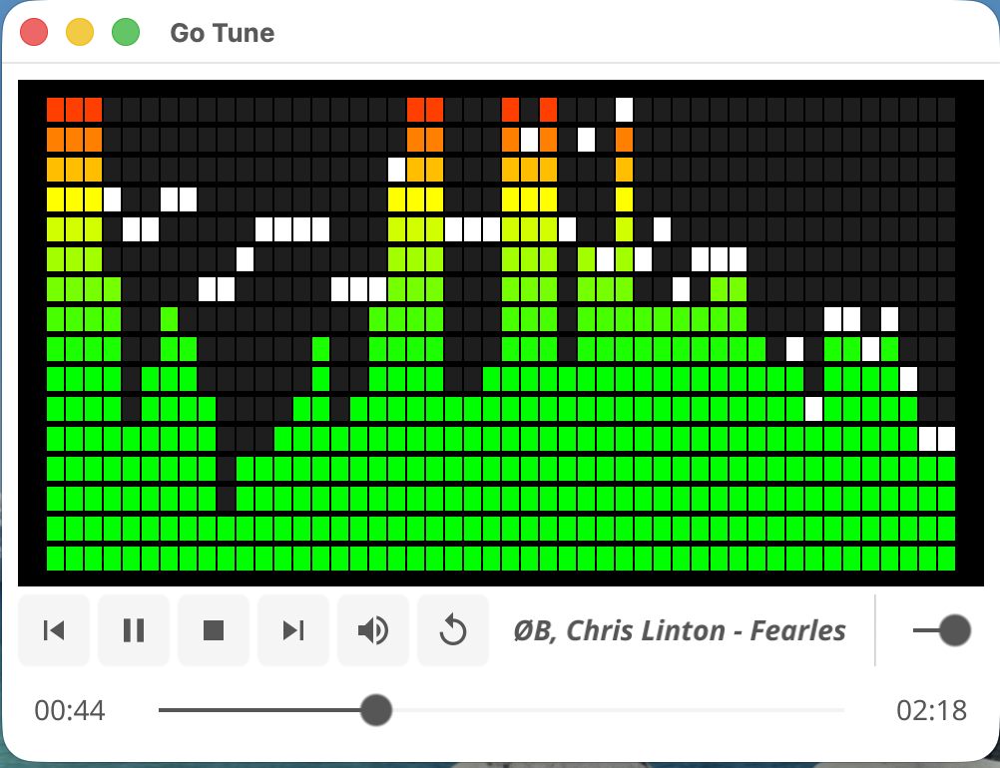
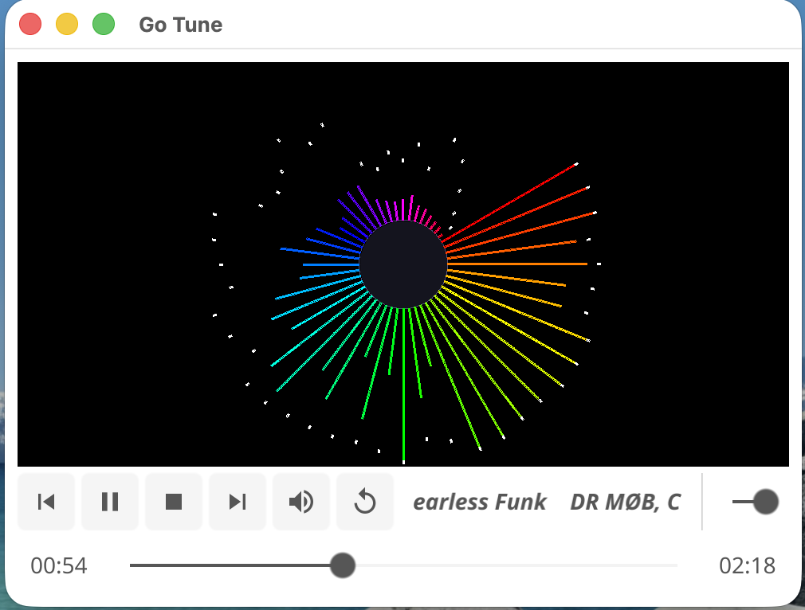

# GoTune

GoTune is a simple, cross-platform music player built with Go and the [Fyne](https://fyne.io/) GUI toolkit. It is designed with a clean, modular architecture, making it easy to understand, extend, and maintain.




## Features

- **Cross-Platform:** Runs on macOS, Linux, and Windows.
- **Clean Architecture:** Follows the principles of Clean Architecture, promoting separation of concerns and testability.
- **Event-Driven:** Uses an event bus for communication between components, ensuring loose coupling.
- **Audio Playback:** Powered by the [BASS audio library](https://www.un4seen.com/), supporting various audio formats.
- **Music Library:** Scan and manage your music library.
- **Playlist Management:** Create and manage playlists.
- **Visualizers:** A variety of audio visualizers to choose from.




## Getting Started

### Prerequisites

- Go 1.25 or later
- A C compiler (GCC or Clang)
- On Linux: `libasound2-dev`

### Installation

1.  **Clone the repository:**

    ```sh
    git clone https://github.com/tejashwikalptaru/gotune.git
    cd gotune
    ```

2.  **Set up the BASS audio libraries:**

    The BASS audio library is required for audio playback. A script is provided to download and extract the necessary files.

    ```sh
    ./scripts/setup-libs.sh
    ```

3.  **Build and run the application:**

    The `Makefile` provides convenient targets for building and running the application.

    ```sh
    make run
    ```

    This will build the application and launch it. The binary will be located in the `build/` directory.

## Documentation

- **[BUILD.md](docs/BUILD.md):** Detailed instructions on how to build and run the project, including platform-specific details and troubleshooting.
- **[DEVELOPMENT.md](docs/DEVELOPMENT.md):** A guide for developers, covering the development workflow, testing, code quality, and architecture.
- **[ARCHITECTURE.md](docs/ARCHITECTURE.md):** An in-depth explanation of the project's architecture.

## Contributing

Contributions are welcome! Please read the **[CONTRIBUTING.md](CONTRIBUTING.md)** file for details on how to contribute to the project.

## License

GoTune is licensed under the MIT License. See the [LICENSE](LICENSE) file for more information.

The BASS audio library is free for non-commercial use. For commercial use, you must obtain a license from [Un4seen Developments](https://www.un4seen.com/).
